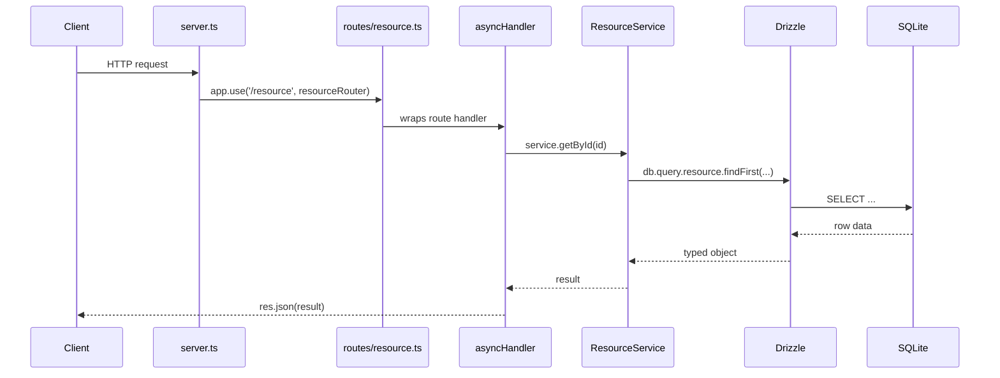
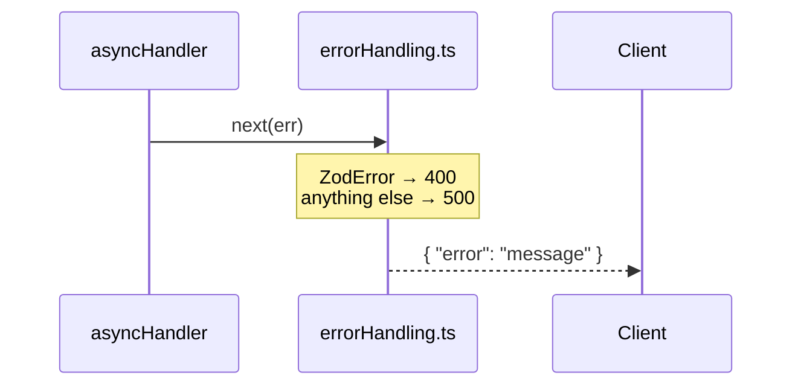

# Pianissimo

A lightweight REST API framework built on Node.js, Express.js, Drizzle ORM, and TypeScript. Pianissimo provides the structure and conventions for building data-driven APIs — routing, validation, error handling, and database access — without dictating what your domain looks like.

This repository includes a **task management example** (projects, tasks, tags) to demonstrate how the framework patterns fit together in a real implementation. The example is not the framework itself.

> **Migration Note**: This is a conversion of the original PHP/Maestro framework application to a modern Node.js REST stack.
>
> **ORM Note (2026-09-18)**: The database layer was migrated from Prisma to [Drizzle ORM](https://orm.drizzle.team/) with [`@libsql/client`](https://github.com/tursodatabase/libsql-client-ts) as the SQLite driver. See [Migration from Prisma to Drizzle](#migration-from-prisma-to-drizzle) below for what changed and why.

## Quick Start

### Prerequisites

- Node.js 20+ (developed and tested against Node.js 26)
- npm

### Installation

```bash
npm install

# Set up the database
npm run db:migrate
npm run db:seed     # Seed with LOTR-themed sample data

npm run dev
```

The API will be available at <http://localhost:4000>.

### Build for Production

```bash
npm run build
npm start
```

---

## Project Structure

```
src/
├── server.ts              # App setup: middleware, route mounting, error handler
├── db/
│   ├── schema.ts           # Drizzle table + relation definitions
│   └── seed.ts             # Database seed script
├── lib/
│   └── db.ts               # Shared Drizzle client (libSQL driver)
├── middleware/
│   └── errorHandling.ts   # asyncHandler wrapper + central error handler
├── routes/                # One file per resource, mounted in server.ts
│   ├── projects.ts
│   ├── tasks.ts
│   └── tags.ts
├── services/              # Business logic (all Drizzle interactions)
│   ├── ProjectService.ts
│   ├── TaskService.ts
│   └── TagService.ts
├── types/
│   └── index.ts           # TypeScript interfaces
└── validation/
    └── schemas.ts         # Zod validation schemas

drizzle/
└── migrations/            # Generated SQL migrations + journal

drizzle.config.ts          # Drizzle Kit configuration
```

---

## Adding a New Route

Every route follows the same four-file pattern: schema → service → router → mount.

### Request flow



### Error flow

When anything throws — a Zod parse failure, a service error, or a Drizzle/SQLite exception — `asyncHandler` forwards it to the central error handler without any per-route try/catch.



### Step-by-step

**1. Add a Zod schema** in `src/validation/schemas.ts`:

```ts
export const createExampleResourceInputSchema = z.object({
  name: z.string().min(1),
});
```

**2. Add a service class** in `src/services/ExampleResourceService.ts`:

```ts
import { db } from '../lib/db';
import { exampleResources } from '../db/schema';

export class ExampleResourceService {
  async getAllExampleResources() {
    return db.query.exampleResources.findMany();
  }

  async createExampleResource(input: { name: string }) {
    const [created] = await db.insert(exampleResources).values(input).returning();
    return created;
  }
}

export const exampleResourceService = new ExampleResourceService();
```

(Add the corresponding table to `src/db/schema.ts` and run `npm run db:generate` + `npm run db:migrate` before using it.)

Export it from `src/services/index.ts`:

```ts
export { exampleResourceService } from './ExampleResourceService';
```

**3. Create the route file** at `src/routes/exampleResources.ts`:

```ts
import { Router } from 'express';
import { exampleResourceService } from '../services';
import { createExampleResourceInputSchema } from '../validation/schemas';
import { asyncHandler } from '../middleware/errorHandling';

export const exampleResourcesRouter = Router();

exampleResourcesRouter.get('/', asyncHandler(async (_req, res) => {
  res.json(await exampleResourceService.getAllExampleResources());
}));

exampleResourcesRouter.post('/', asyncHandler(async (req, res) => {
  const input = createExampleResourceInputSchema.parse(req.body);
  res.status(201).json(await exampleResourceService.createExampleResource(input));
}));
```

**4. Mount it** in `src/server.ts`:

```ts
import { exampleResourcesRouter } from './routes/exampleResources';

app.use('/exampleResources', exampleResourcesRouter);
```

That's it — validation errors, service errors, and database errors are all handled automatically by `errorHandling.ts`.

---

## API Reference

Base URL: `http://localhost:4000`

### Projects

| Method | Path | Description |
| --- | --- | --- |
| GET | `/projects` | List all projects |
| GET | `/projects/:id` | Get a project |
| POST | `/projects` | Create a project |
| PUT | `/projects/:id` | Update a project |
| DELETE | `/projects/:id` | Delete a project |

**Create / Update body:**

```json
{ "title": "My Project", "description": "Optional" }
```

### Tasks

| Method | Path | Description |
| --- | --- | --- |
| GET | `/tasks` | List tasks (filterable) |
| GET | `/tasks/:id` | Get a task |
| POST | `/tasks` | Create a task |
| PUT | `/tasks/:id` | Update a task |
| DELETE | `/tasks/:id` | Delete a task |
| POST | `/tasks/:taskId/tags/:tagId` | Add tag to task |
| DELETE | `/tasks/:taskId/tags/:tagId` | Remove tag from task |

**Query parameters for `GET /tasks`:**

- `projectId` — filter by project
- `tagId` — filter by tag
- `priority` — filter by priority (0–3)
- `status` — filter by status (0–4)

**Create body:**

```json
{
  "title": "New Task",
  "description": "Optional",
  "priority": 2,
  "status": 0,
  "progress": 0,
  "projectId": 1
}
```

### Tags

| Method | Path | Description |
| --- | --- | --- |
| GET | `/tags` | List all tags |
| GET | `/tags/:id` | Get a tag |
| POST | `/tags` | Create a tag |
| PUT | `/tags/:id` | Update a tag |
| DELETE | `/tags/:id` | Delete a tag |

**Create / Update body:**

```json
{ "title": "My Tag" }
```

### Health

```
GET /health
```

---

## Error Responses

All errors return JSON with an `error` field:

```json
{ "error": "Task not found" }
```

| Status | Meaning |
| --- | --- |
| 400 | Validation error |
| 404 | Resource not found |
| 500 | Server / database error |

---

## Validation Rules

### Tasks

- `title` — required, min 1 character
- `priority` — required (create), integer 0–3
- `status` — required (create), integer 0–4
- `progress` — optional, integer 0–100, defaults to 0
- `description` — optional
- `projectId` — optional

### Projects & Tags

- `title` — required, min 1 character
- `description` — optional (projects only)

---

## Available Scripts

```bash
npm run dev              # Start dev server with hot reload
npm run build            # Compile TypeScript
npm start                # Run compiled build

npm run db:generate      # Generate a SQL migration from src/db/schema.ts
npm run db:migrate       # Apply pending migrations
npm run db:seed          # Seed sample data
npm run db:studio        # Open Drizzle Studio GUI
npm run type-check       # TypeScript check without building
```

---

## Environment Variables

```env
DATABASE_URL="file:./database.sqlite"
PORT=4000
NODE_ENV=development
```

---

## Dependencies

### Production

- **express** — web framework
- **drizzle-orm** — database ORM
- **@libsql/client** — SQLite driver (local file mode, no native compilation)
- **zod** — runtime validation
- **cors** — CORS middleware

### Development

- **drizzle-kit** — CLI for migrations and Drizzle Studio
- **typescript**, **ts-node-dev** — TypeScript tooling

---

## Sample Data

The seed script populates the example domain with Lord of the Rings themed data:

- **3 Projects**: The Fellowship of the Ring, The Two Towers, The Return of the King
- **4 Tags**: Men, Hobbits, Elves, Dwarves
- **15 Tasks**: distributed across projects with tag associations

---

## Security Notes

- Input validated with Zod before reaching the database
- Drizzle uses parameterized queries (SQL injection safe)
- CORS enabled for local development

---

## Migration from PHP

The example domain was originally built on a PHP/Maestro framework. Pianissimo is its Node.js successor.

| Aspect | PHP | Pianissimo |
| --- | --- | --- |
| Framework | Custom Maestro MVC | Express.js |
| ORM | Repository Pattern (PDO) | Drizzle ORM |
| API | REST | REST |
| Language | PHP 8.2 | TypeScript 5.x |
| Validation | Manual | Zod |
| Database | SQLite | SQLite |

**Original Authors**: Frans Blauw, Valeria Stamenova

---

## Migration from Prisma to Drizzle

The database layer originally used Prisma (`@prisma/client` v7) with the `@prisma/adapter-better-sqlite3` driver. It was migrated to [Drizzle ORM](https://orm.drizzle.team/) on `@libsql/client`, mainly to get away from `better-sqlite3`'s native compilation (node-gyp builds that can break across Node version upgrades).

### Why `@libsql/client` and not `better-sqlite3` again

Drizzle also supports `better-sqlite3` directly, which would have been a smaller change. It was skipped because it has the same native-binding failure mode this migration was meant to fix. `@libsql/client` ships prebuilt binaries for more platforms and is actively maintained; it still works as a plain local SQLite file (`file:./database.sqlite`) with no server or remote account needed.

Drizzle's `1.0` release line adds a driver for Node's built-in `node:sqlite` module, which would remove native bindings entirely. It wasn't used here because that release is still a release candidate (not yet the `latest` npm tag) as of this migration.

### What changed

| Aspect | Prisma | Drizzle |
| --- | --- | --- |
| Schema | `prisma/schema.prisma` (custom DSL) | `src/db/schema.ts` (plain TypeScript) |
| Client | Generated into `generated/prisma/` | `drizzle-orm/libsql`, no codegen |
| Driver | `better-sqlite3` (native, via adapter) | `@libsql/client` |
| Migrations | `prisma/migrations/` | `drizzle/migrations/` |
| Migration commands | `npm run prisma:migrate` | `npm run db:generate` + `npm run db:migrate` |
| Seed script | `prisma/seed.ts` | `src/db/seed.ts` |
| DB GUI | `npm run prisma:studio` | `npm run db:studio` |
| Query style | `prisma.task.findMany({ include: ... })` | `db.query.tasks.findMany({ with: ... })` |

The underlying SQLite table structure (names, columns, foreign keys, cascade behavior) is unchanged — the initial Drizzle migration in `drizzle/migrations/0000_init.sql` recreates the same schema the Prisma migration did.

One behavioral fix made during the migration: `tasks.createdAt` previously relied on SQLite's `DEFAULT CURRENT_TIMESTAMP`, which stores a text timestamp that doesn't parse against Drizzle's integer/epoch `timestamp` column mode (it read back as `null`). The default is now computed in the application layer via `$defaultFn(() => new Date())` in `src/db/schema.ts` instead of in SQL.

If you have an existing `database.sqlite` from before this migration, delete it and re-run `npm run db:migrate` + `npm run db:seed` — the column layout is identical, but starting fresh avoids any doubt about which migration history applied.

---

## License

MIT
