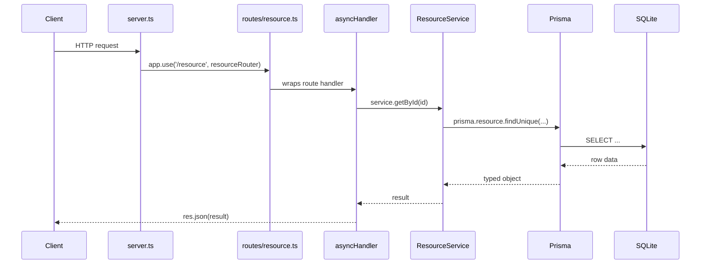
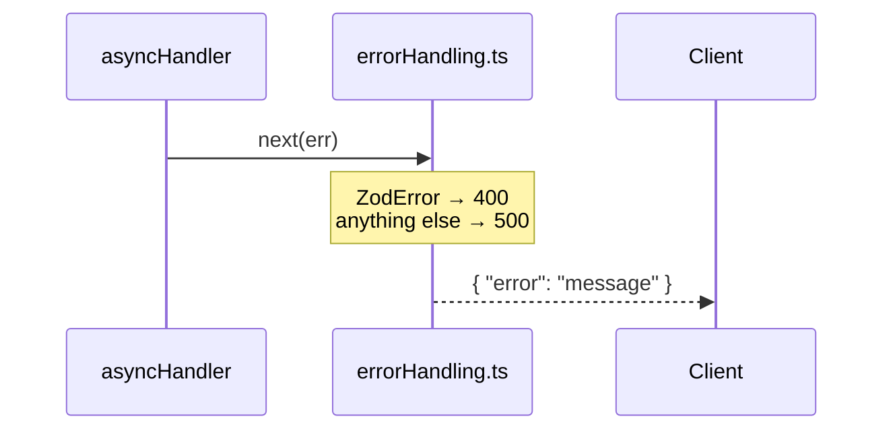

# Allegro

A lightweight REST API framework built on Node.js, Express.js, Prisma, and TypeScript. Allegro provides the structure and conventions for building data-driven APIs — routing, validation, error handling, and database access — without dictating what your domain looks like.

This repository includes a **task management example** (projects, tasks, tags) to demonstrate how the framework patterns fit together in a real implementation. The example is not the framework itself.

> **Migration Note**: This is a conversion of the original PHP/Maestro framework application to a modern Node.js REST stack.

## Quick Start

### Prerequisites

- Node.js 18+
- npm

### Installation

```bash
npm install

# Set up the database
npm run prisma:migrate
npm run prisma:seed     # Seed with LOTR-themed sample data

npm run dev
```

The API will be available at <http://localhost:4000>.

### Build for Production

```bash
npm run build
npm start
```

---

## Project Structure

```
src/
├── server.ts              # App setup: middleware, route mounting, error handler
├── lib/
│   └── prisma.ts          # Shared Prisma client (SQLite adapter)
├── middleware/
│   └── errorHandling.ts   # asyncHandler wrapper + central error handler
├── routes/                # One file per resource, mounted in server.ts
│   ├── projects.ts
│   ├── tasks.ts
│   └── tags.ts
├── services/              # Business logic (all Prisma interactions)
│   ├── ProjectService.ts
│   ├── TaskService.ts
│   └── TagService.ts
├── types/
│   └── index.ts           # TypeScript interfaces
└── validation/
    └── schemas.ts         # Zod validation schemas

prisma/
├── schema.prisma          # Prisma data model
└── seed.ts                # Database seed script

generated/
└── prisma/                # Generated Prisma client (do not edit)

prisma.config.ts           # Prisma 7 configuration
```

---

## Adding a New Route

Every route follows the same four-file pattern: schema → service → router → mount.

### Request flow



### Error flow

When anything throws — a Zod parse failure, a service error, or a Prisma exception — `asyncHandler` forwards it to the central error handler without any per-route try/catch.



### Step-by-step

**1. Add a Zod schema** in `src/validation/schemas.ts`:

```ts
export const createExampleResourceInputSchema = z.object({
  name: z.string().min(1),
});
```

**2. Add a service class** in `src/services/ExampleResourceService.ts`:

```ts
import { prisma } from '../lib/prisma';

export class ExampleResourceService {
  async getAllExampleResources() {
    return prisma.exampleResource.findMany();
  }

  async createExampleResource(input: { name: string }) {
    return prisma.exampleResource.create({ data: input });
  }
}

export const exampleResourceService = new ExampleResourceService();
```

Export it from `src/services/index.ts`:

```ts
export { exampleResourceService } from './ExampleResourceService';
```

**3. Create the route file** at `src/routes/exampleResources.ts`:

```ts
import { Router } from 'express';
import { exampleResourceService } from '../services';
import { createExampleResourceInputSchema } from '../validation/schemas';
import { asyncHandler } from '../middleware/errorHandling';

export const exampleResourcesRouter = Router();

exampleResourcesRouter.get('/', asyncHandler(async (_req, res) => {
  res.json(await exampleResourceService.getAllExampleResources());
}));

exampleResourcesRouter.post('/', asyncHandler(async (req, res) => {
  const input = createExampleResourceInputSchema.parse(req.body);
  res.status(201).json(await exampleResourceService.createExampleResource(input));
}));
```

**4. Mount it** in `src/server.ts`:

```ts
import { exampleResourcesRouter } from './routes/exampleResources';

app.use('/exampleResources', exampleResourcesRouter);
```

That's it — validation errors, service errors, and database errors are all handled automatically by `errorHandling.ts`.

---

## API Reference

Base URL: `http://localhost:4000`

### Projects

| Method | Path | Description |
| --- | --- | --- |
| GET | `/projects` | List all projects |
| GET | `/projects/:id` | Get a project |
| POST | `/projects` | Create a project |
| PUT | `/projects/:id` | Update a project |
| DELETE | `/projects/:id` | Delete a project |

**Create / Update body:**

```json
{ "title": "My Project", "description": "Optional" }
```

### Tasks

| Method | Path | Description |
| --- | --- | --- |
| GET | `/tasks` | List tasks (filterable) |
| GET | `/tasks/:id` | Get a task |
| POST | `/tasks` | Create a task |
| PUT | `/tasks/:id` | Update a task |
| DELETE | `/tasks/:id` | Delete a task |
| POST | `/tasks/:taskId/tags/:tagId` | Add tag to task |
| DELETE | `/tasks/:taskId/tags/:tagId` | Remove tag from task |

**Query parameters for `GET /tasks`:**

- `projectId` — filter by project
- `tagId` — filter by tag
- `priority` — filter by priority (0–3)
- `status` — filter by status (0–4)

**Create body:**

```json
{
  "title": "New Task",
  "description": "Optional",
  "priority": 2,
  "status": 0,
  "progress": 0,
  "projectId": 1
}
```

### Tags

| Method | Path | Description |
| --- | --- | --- |
| GET | `/tags` | List all tags |
| GET | `/tags/:id` | Get a tag |
| POST | `/tags` | Create a tag |
| PUT | `/tags/:id` | Update a tag |
| DELETE | `/tags/:id` | Delete a tag |

**Create / Update body:**

```json
{ "title": "My Tag" }
```

### Health

```
GET /health
```

---

## Error Responses

All errors return JSON with an `error` field:

```json
{ "error": "Task not found" }
```

| Status | Meaning |
| --- | --- |
| 400 | Validation error |
| 404 | Resource not found |
| 500 | Server / database error |

---

## Validation Rules

### Tasks

- `title` — required, min 1 character
- `priority` — required (create), integer 0–3
- `status` — required (create), integer 0–4
- `progress` — optional, integer 0–100, defaults to 0
- `description` — optional
- `projectId` — optional

### Projects & Tags

- `title` — required, min 1 character
- `description` — optional (projects only)

---

## Available Scripts

```bash
npm run dev              # Start dev server with hot reload
npm run build            # Compile TypeScript
npm start                # Run compiled build

npm run prisma:migrate   # Run database migrations
npm run prisma:seed      # Seed sample data
npm run prisma:studio    # Open Prisma Studio GUI
npm run type-check       # TypeScript check without building
```

---

## Environment Variables

```env
DATABASE_URL="file:./database.sqlite"
PORT=4000
NODE_ENV=development
```

---

## Dependencies

### Production

- **express** — web framework
- **@prisma/client** (v7) — database ORM
- **@prisma/adapter-better-sqlite3** — SQLite driver for Prisma 7
- **better-sqlite3** — SQLite native driver
- **zod** — runtime validation
- **cors** — CORS middleware

### Development

- **prisma** (v7) — CLI for migrations and codegen
- **typescript**, **ts-node-dev** — TypeScript tooling

---

## Sample Data

The seed script populates the example domain with Lord of the Rings themed data:

- **3 Projects**: The Fellowship of the Ring, The Two Towers, The Return of the King
- **4 Tags**: Men, Hobbits, Elves, Dwarves
- **15 Tasks**: distributed across projects with tag associations

---

## Security Notes

- Input validated with Zod before reaching the database
- Prisma uses parameterized queries (SQL injection safe)
- CORS enabled for local development

---

## Migration from PHP

The example domain was originally built on a PHP/Maestro framework. Allegro is its Node.js successor.

| Aspect | PHP | Allegro |
| --- | --- | --- |
| Framework | Custom Maestro MVC | Express.js |
| ORM | Repository Pattern (PDO) | Prisma |
| API | REST | REST |
| Language | PHP 8.2 | TypeScript 5.x |
| Validation | Manual | Zod |
| Database | SQLite | SQLite |

**Original Authors**: Frans Blauw, Valeria Stamenova

---

## License

MIT
